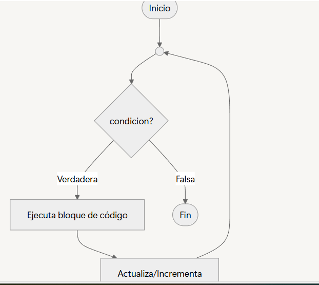
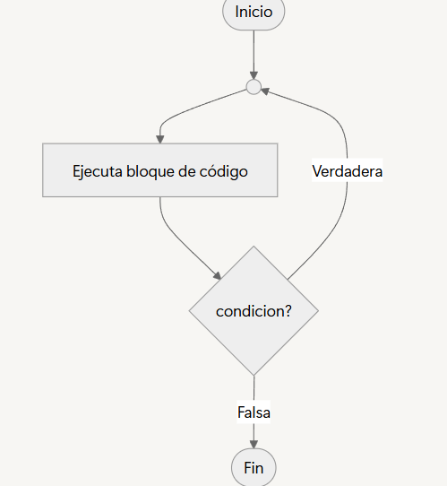

Preguntas de control
  
  

¿Qué sucedería si contador++ estuviera fuera del bucle?  
se ejecutaria un bucle infinito, porque va a hacer que la condicion   
no sea falsa en ningun momento.  

¿Qué pasa si nunca se cumple la condición dentro del while?  
El codigo dentro del ciclo no se ejecuta y el propgrama sigue con el   
resto de instrucciones.  

   
  
¿Por qué el bloque de instrucciones se ejecuta siempre al menos una vez?  
Porque en el bucle la condicion se evalua despues de ejecutar el bloque de codigo.    

¿Qué diferencia ves con while?  
Que con `while` verifica la condición antes de ejecutar el bloque en cambio con `do while` se verifica luego de ejecutar el bloque de codigo.